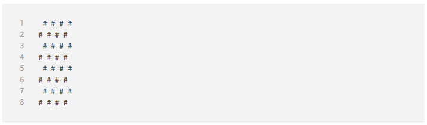
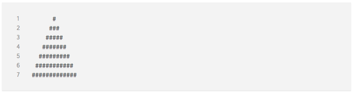

# Laboration 2

Syfte med laborationen:

* att öva på att skriva dokumentation i form av kommentarer
* att lösa ett givet problem grundat på en beskrivning
* att öva på att använda `if`, `for` och Arrayer

Inlämning sker i form av en mapp (zippad) innehållande:

* en HTML-fil
* en JavaScript-fil
* lösning på alla __Uppgifter__ - lösningarna placeras i er JavaScript-fil

Övrigt:

* varje lösning måste innehålla kommentarer som beskriver hur ni valt att lösa problemet
* ni måste använda er av `"use strict";`
* ni måste använda er av [JSHint](http://jshint.com/)
* [Här finner ni information om Arrayer](https://developer.mozilla.org/en-US/docs/Web/JavaScript/Reference/Global_Objects/Array)

Försök inte att lösa ett givet problem direkt, gör det istället stegvis för att slutligen nå en lösning.

## Uppgift 1

Ta reda på hur ni kan få innehållet av en Array att placeras i motsats ordning. Det vill säga att `[1, 2, 3]` hade blivit `[3, 2, 1]`. Utgå och färdigställ kodexemplet nedan.

``` js
var values = [3, 5, "Jane", true, 144, false];
console.log(/* Skriv ut Arrayen fast baklänges här */);
```

## Uppgift 2

Ta reda på hur ni kan slå ihopa en eller flera Arrayer. Det vill säga att om vi har följande kod:

``` js
var firstArray = [1, 2, 3, 4, 5];
var secondArray = [6, 7, 8, 9, 10];
```

Hade vi därefter fått en ny Array innehållande `[1, 2, 3, 4, 5, 6, 7, 8, 9, 10]`. Utgå och färdigställ kodexemplet nedan.

``` js
var names = ["Jane", "Joe", "Eliza"];
var ages = [21, 34, 22];
var hasPet = [true, false, true];

// Färdigställ med er kod här
var multipleArrays;
```

## Uppgift 3

Ta reda på hur ni kan slå ihop alla element av en Array med eller utan en sträng. Det vill säga, hur kan vi få Arrayen `["Sherlock", "Watson", "Bo"]` att bli strängen `"Sherlock, Watson, Bo"`. Ni kan utgå från dessa tre namn och exempelsträngen (skriv ut resultatet med `console.log`).

## Uppgift 4

Skapa en loop som skriver ut det resultat som visas nedan. Ni måste använda er av en variabel, exempelvis `var size`, som bestämmer antal upprepningar av er loop. Det vill säga att värdet för denna variabeln (siffra) styr storleken av utskriften som visas nedan.

```
// Exempel
#
##
###
####
#####
######
#######
########
```

Tänk på att ni kan skapa en sträng som innehåller `var hashtags = "#";`, ni kan därefter fortsätta lägga till hashtags i denna genom att skriva `hashtags += "#"` i er loop.

## Uppgift 5

Skapa ett program som skriver ut alla siffror mellan `1` till `100`, med följande krav:

* om siffran är delbar med `3` ska ni istället skriva ut `Foo`
* om siffran är delbar med `5` ska ni istället skriva ut `Bar`
* om en siffra är delbar med `3` **och** `5` ska ni istället skriva ut `FooBar`
* övriga siffror skriver ni bara ut utan modifikation

Tänk på att ni kommer behöva använda er av `if` för att kontrollera om en siffra är delbar med `3` eller `5`. Detta kan ni exempelvis göra genom modulus operatorn `%`. Denna operator fungerar på följande vis:

``` js
// Kontrollera om variabeln "age" är delbar med 2
var age = 18;

if (age % 2 == 0) {
    console.log("Age is divisible by 2");
}
```

Nedan finner ni även ett exempel på utskriften av de 15 första talen:

```
1
2
Foo
4
Bar
Foo
7
8
Foo
Bar
11
Foo
13
14
FooBar
```

## Uppgift 6

Utifrån följande Array:

``` js
var twoDimensional = [
    [1, 2, 3, 4, 5],
    [6, 7, 8, 9, 10],
    [11, 12, 13, 14, 15]
];
```

Så vill vi få följande utskrift:

```
"Array 1 contains:"
1
2
3
4
5
"Array 2 contains:"
6
7
8
9
10

...osv.
```

Detta måste göras genom att ni använder **två** stycken `for` loopar tillsammans (inuti varandra).

## Extrauppgifter

Dessa är ganska svåra så försök gärna göra dessa tillsammans.

### Extrauppgift 1

Skapa ett program som skriver ut ett schackbräde likt utskriften nedan. Ni ska skapa en sträng som innehåller hela detta schackbräde så att ni i slutet kan göra **en** `console.log` för att skriva ut detta. Tänk att ni skapa **en** sträng i form av ett rutnät med dimensionerna 8x8.



För att skapa ett radbryt i en sträng används `\n`. För att demonstrera kan ni testa följande:

``` js
// Observera ur "\n" skapar ett radbryt
var person = "Name: Jane Doe\nAge: 26";
console.log(person);
```

**Tips**

Uppgiften kräver att ni har en `for` loop inuti en annan `for` loop, dvs. två stycken. Dessa två loopar kommer tillsammans fylla på den variabel som representerar rutnätet. Tänk på att varje loop har en egen räknare och dessa behöver därmed varsitt namn. För att ta reda på om ni ska spara ett mellanslag `" "` eller en hashtag `"#"` i er variabel kan ni utgå från följande: räkna ut summan av era räknare och kontrollera om denna är delbar med `2` - om så är fallet sparar ni ett mellanslag i er variabel annars en hashtag.

Tänk även på att det är i den yttre loopen ni kommer behöva lägga till ett radbryt.

### Extrauppgift 2

Försök att få följande utskrift genom att använda er av en kombination av `for` loopar och Arrayer.


