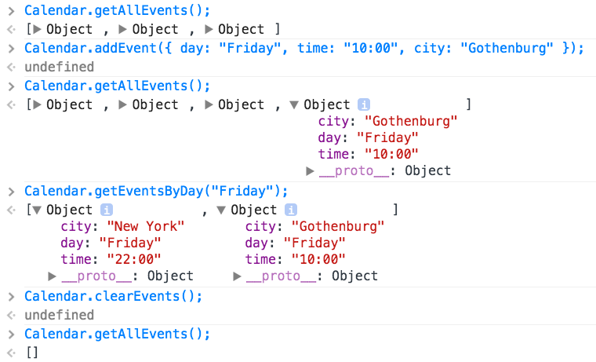

# Laboration 4

Syfte med laborationen:

* att öva på att använda objekt i olika situationer.
* att fortsätta öva på att använda funktioner, kontrollstrukturer och att skriva dokumentation.

Inlämning sker i form av en mapp (zippad) innehållande:

* en HTML-fil
* en JavaScript-fil
* lösning på alla __Uppgifter__ - lösningarna placeras i er JavaScript-fil

Övrigt:

* ni måste använda er av `"use strict";`
* ni måste använda er av [JSHint](http://jshint.com/)

### Uppgift 1

Givet följande kod:


var box = {
    width: 12,
    height: 16
};


Skapa en `if`-sats som kontrollerar om attributet `area` inte finns i objektet __box__, om det inte finns ska detta läggas till och uträknas (för att räkna ut area använder ni formeln `höjd * bredd`).

Skapa en `if`-sats som kontrollerar om attributet `area` finns i objektet `box`, om det finns så skriver vi ut arean, om det inte finns räknar vi ut arean och lägger till attributet `area` med detta värdet på objektet `box`.

### Uppgift 2

Givet följande kod:


var person = {
    firstname: "Jane",
    lastname: "Doe",
    age: 31,
    siblings: ["Peter", "Eliza"],
    anonymous: true,
    city: "Miami",
    state: "California"
};


Skapa funktionen `print` som tar emot ett objekt som ett argument och skriver ut alla dess attribut. För att gå igenom alla attribut använder ni en `for`-loop: `for (var prop in obj) { ... }`.

### Uppgift 3

Skapa funktionen `attributes` som tar emot ett objekt som ett argument och returnerar __en__ array innehållande namnen på alla attribut. Nedan presenteras ett mindre exempel.


// Vårt objekt har attributen "width" och "height"
var box = {
    width: 12,
    height: 16
};

// Returnerar en array av alla attribut
var attrs = attributes(box);

// Skriver ut: ["width", "height"]
console.log(attrs); 


Testa även gärna med objektet från föregående uppgift.

### Uppgift 4

Skapa funktionen `Triangle` som tar emot två argument, höjd och bredd, och returnerar ett objekt innehållande dessa attribut, men även ett tredje - `area`. Detta attribut ska vara en funktion som räknar ut och returnerar arean för en triangel, använd följande formel: `A = B * H / 2`. För att funktionen ska använda sig av objektets attribut (höjd och bredd) måste ni använda er av nyckelordet `this` i funktionen. Nedan presenteras ett exempel.


// Skapa en triangel i variabeln "t"
var t = Triangle(14, 12);

// Kontrollera våra attribut
t.width; // => 14
t.height; // => 12
t.area(); // => 84


### Uppgift 5

I denna uppgiften kommer vi utgå från följande objekt:


var Calendar = {
    events: [
        { day: "Monday", time: "19:30", city: "Stockholm" },
        { day: "Thursday", time: "21:45", city: "Miami" },
        { day: "Friday", time: "22:00", city: "New York" }
    ]
};


Med detta som utgångspunkt kommer vi lägga till ett antal metoder (dvs. funktioner). En metod kan läggas till på ett av två vis, där ni själva får bestämma vilket ni väljer - så länge ni är konsekventa. Nedan demonstreras dessa två.



var Calendar = {
    events: [],
    // Antingen direkt i vårt objekt
    getAllEvents: function() {
        /* Kod... */
    }
};

// Eller i efterhand
Calendar.getAllEvents = function() {
    /* Kod... */
};


Följande metoder ska läggas till:

* `getAllEvents`, denna metod returnerar alla events som är sparade i attributet `events`.
* `addEvent`, denna metod tar emot ett event som sedan läggs till i vår array av events. Ett `event` är ett objekt innehållande attributen `day`, `time` och `city`.
* `clearEvents`, denna metod raderar alla våra events.
* `getEventsByDay`, denna metod tar emot en dag (sträng) och returnerar en array av alla de event som sker på denna dag.

Nedan presenteras ett exempel av hur dessa metoder kan användas tillsammans för att ni ska få en tydligare inblick.


// Vi utgår från följande grund
var Calendar = {
    events: [
        { day: "Monday", time: "19:30", city: "Stockholm" },
        { day: "Thursday", time: "21:45", city: "Miami" },
        { day: "Friday", time: "22:00", city: "New York" }
    ]
};


 _Figur 1. Exempel på utskrift från webbkonsollen._

Ytterligare ett krav ställs på att ni måste dokumentera samtliga metoder med en kommentar som kort beskriver vad metoden utför.
