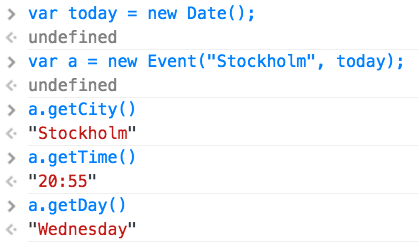

# Laboration 5

Syfte med laborationen:

* att fortsätta öva på att använda objekt.
* att använda sig av prototyper.
* att fortsätta öva på att använda funktioner, kontrollstrukturer och att skriva dokumentation.

Inlämning sker i form av en mapp (zippad) innehållande:

* en HTML-fil
* en JavaScript-fil
* lösning på alla __Uppgifter__ - lösningarna placeras i er JavaScript-fil

Övrigt:

* ni måste använda er av `"use strict";`
* ni måste använda er av [JSHint](http://jshint.com)
* ni måste använda er av objekt och prototyper
* samtliga metoder (funktioner) som skapas måste dokumenteras med en kommentar

## Uppgiften

I denna laboration är det endast __en__ uppgift och således är den en aning mer omfattande än tidigare uppgifter. Uppgifter utgår delvis från [Uppgift 5](http://mah-webb.github.io/courses/me152a/exercises/E04.html#uppgift-5) från laboration 4 fast i detta fallet kommer ni skapa en större helhet och utgå från att använda prototyper.

Ni kommer att arbeta med tre (varav två kommer ni skapa själva) objekt: `Calendar`, `Event` och `Date`. Där den sista redan finns inbyggd i JavaScript vilket innebär att ni kommer behöva använda er av dokumentationen som ni finner [här](https://developer.mozilla.org/en-US/docs/Web/JavaScript/Reference/Global_Objects/Date). 

### Event

Objektet `Event` kommer ha tre stycken metoder och kommer även att använda sig av det inbyggda objektet `Date`.

Nedan kommer "stubbar" (dvs. definitionerna av alla metoderna) för `Event` att presenteras och efter visas ett exempel från konsollen, er uppgift är att färdigställa samtliga av dessa metoder.


// Vår konstruktor funktion
function Event(city, date) {
    /* ... */
}

// Denna metod returnerar staden som angavs
// i vår konstruktor, exempelvis "Stockholm"
Event.prototype.getCity = function() {
    /* ... */
};

// Denna metod returnerar tiden i formatet
// timmar + minuter, exempelvis "15:22"
Event.prototype.getTime = function() {
    /* ... */
};

// Denna metod returnerar dagen då vårt
// event är planerat, exempelvis "Monday"
Event.prototype.getDay = function() {
    /* ... */
};


Tänk på att objektet `Date` kommer att användas, nedan presenteras ett mindre exempel för att underlätta.


// Om vi anropar Date utan argument får vi "idag"
var today = new Date();
today.getDay(); // ?
today.getHours(); // ?

// Om vi anropar Date med en sträng enlight formatet
// nedan får vi ett datum på en bestämd dag och tid
var future = new Date("2017-01-04 14:30:00");


Nedan visas ett exempel från konsollen.

 _Figur 1. Exempel på utskrift från webbkonsollen._

### Calendar

Objektet `Calendar` kommer att innehålla 6 stycken metoder som kommer att läggas till genom prototypen så som för `Event`. Konstruktor funktionen för `Calendar` kommer att ha följande stubb.


// Konstruktor funktion, observera att denna
// tar emot en array innehållande en eller flera "Event"
function Calendar(events) {
    /* ... */
}


`Calendar` kommer att ha följande metoder.

* `getEvents` - returnerar alla events.
* `addEvent` - lägger till ett event i arrayen av alla events. I denna metod måste ni kontrollera om det event som läggs till är en instans (`instanceof`) av `Event` innan det läggs till, om så är fallet returnerar metoden `true` annars `false` (utöver att eventet läggs till).
* `clearEvents` - tömmer arrayen av events. I denna metod måste ni kontrollera om det finns några events, om så är fallet tar ni bort dessa och returnerar `true` annars `false`.
* `getEventsByDay` - returnerar en array innehållande alla events som sker på en given dag, exempelvis "Monday".
* `getEventsByTime` - returnerar en array innehållande alla events som sker på en given tid, exempelvis "12:30".
* `getEventsByCity` - returnerar en array innehållande alla events som sker i en given stad, exempelvis "Stockholm".

Metoderna `getEventsByDay`, `getEventsByTime` och `getEventsByCity` får __inte__ använda sig av den klassiska `for (...) {...}`-loopen, utan istället måste dessa använda sig av [Array.prototype.forEach](https://developer.mozilla.org/en-US/docs/Web/JavaScript/Reference/Global_Objects/Array/forEach) för att gå igenom alla events. Nedan visas ett mindre exempel på hur detta fungerar.


// Den array vi vill gå igenom
var numbers = [1, 2, 3, 4, 5];

// Vad vill vi göra med varje nummer?
function logNumber(number) {
    console.log(number);
}

// Applicera funktionen "logNumber" på alla nummer
numbers.forEach(logNumber);


För att testa att er `Calendar` fungerar kan ni använda följande array av `Event`, det är givetvis tillåtet att skapa detta på egen hand.


// Array av olika Events, notera att vi kan
// skapa dessa direkt i vår array
var events = [
    new Event("Stockholm", new Date("2015-03-02 19:30:00")),
    new Event("Miami", new Date("2015-03-05 21:45:00")),
    new Event("New York", new Date("2015-03-06 22:00"))
];

// Skapa en instans av vår kalender innehållande
// dessa events
var calendar = new Calendar(events);

