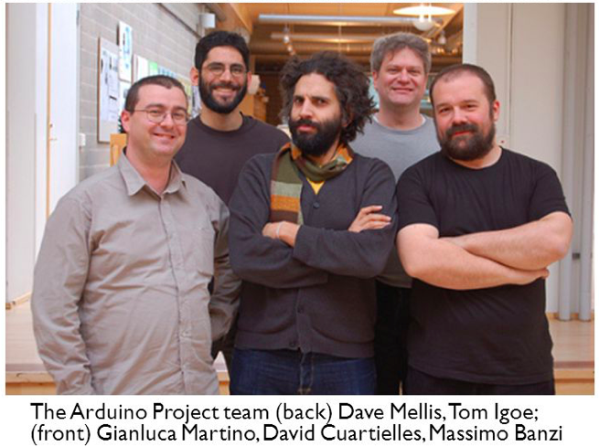
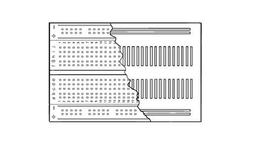

# Arduino introduction

## History

Introduced in 2005, developed by people from the Interaction Design Institute in Ivrea (Massimo Banzi), from Malmö University (David Cuarielles) and some more to replace expensive systems that broke all the time. 

- Developed for design students
- Now used by students, designers, artists, "makers", engineers...

## Arduino philosophy

- Cheap
- Easy learning curve
- Available for all platforms (win/mac/linux)
- Open software and open hardware

## Arduino technology

The base is a small circuit board with a micro controller, and inputs and outputs:

The board is expandable by "shields". This is for example an Wifi shield that can be stacked on top of the Arduino. 

 

There are many different shields available, both official shields, and third party shields. 

## Installing the IDE

The Arduino programs are called sketches and are made on any standard computer with the Arduino Integrated Development Environment. It is then downloaded to the Arduino, and after that, the Arduino can work by itself. The IDE can be downloaded at

[arduino.cc -> Download](http://arduino.cc/en/Main/Software#toc2)

Installation instructions:

- [Windows](http://arduino.cc/en/Guide/Windows)
- [Mac](http://arduino.cc/en/Guide/MacOSX)
- [Linux](http://playground.arduino.cc/Learning/Linux)

## The first "sketch": make an LED blink


/*
  Blink
  Turns on an LED on for one second, then off for one second, repeatedly.
 
  This example code is in the public domain.
 */
 
// Pin 13 has an LED connected on most Arduino boards.
// give it a name:
int led = 13;

// the setup routine runs once when you press reset:
void setup() {                
  // initialize the digital pin as an output.
  pinMode(led, OUTPUT);     
}

// the loop routine runs over and over again forever:
void loop() {
  digitalWrite(led, HIGH);   // turn the LED on (HIGH is the voltage level)
  delay(1000);               // wait for a second
  digitalWrite(led, LOW);    // turn the LED off by making the voltage LOW
  delay(1000);               // wait for a second
}


## The breadboard

The breadboard is very useful for connecting the inputs and outputs of the Arduino. 

## Sensors

Used as inputs. Can be a button, a light sensor, a sound sensor, a touch sensor and much more.

## Actuators

Used as outputs. An actuator can produce for example sound (a speaker), light (an LED) or movement (a motor).

