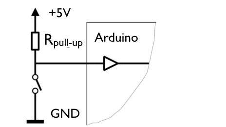

# Workshop 2 - Sensors and Actuators

## Sensors

Sensors are the inputs to the Arduino. A normal computer has typically a keyboard and a mouse as a input. The Arduino can have wide range of sensors as input, for example:

- A simple button or switch
- A pressure sensor
- A light sensor
- A potentiometer
- A temperature sensor
- A humidity sensor
- A touch sensor

The only thing the Arduino can sense, or measure, is *voltage* . Some sensors give a *voltage* directly, but many sensors don't give a voltage directly, and that means that we have to make an electric circuit that will transform the output of the sensor to voltage. Some sensors such as potentiometers, light sensors, pressure sensors, buttons and switches give a variable resistance as output. A variable resistance can easily be converted to a voltage with the help of a *voltage divider*.

We start with a push button. A push button has two states, *pushed* meaning *very low resistance* or *not pushed* meaning *infinite resistance*. To connect a push button, you need something called a *pull up resistor* (actually you can also use a pull down resistor, or even a built-in pull up resistor in the Arduino, as described in [this tutorial](http://arduino.cc/en/Tutorial/DigitalPins)).

A good value for the pull up resistor is somewhere around 10k (10k is short for 10000 ohms).

Some tests with greek characters:

&#937;

Seemed to work. 470&#937; is an interesting number. 

## Actuators

Used as outputs. An actuator can produce for example sound (a speaker), light (an LED) or movement (a motor).

